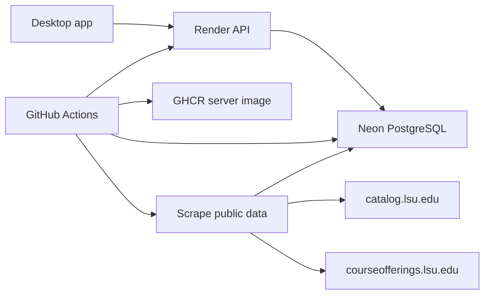

# JevSchedule

JevSchedule is a desktop course planner for LSU CSC students. Track completed courses,
explore degree requirements, plan semesters, and build a conflict-free weekly schedule.
See the [project wiki](https://github.com/Sweet-Rice/shep4proj/wiki) for the project plan,
architecture, and backlog.

## Install

Download v1.1.0 from [GitHub Releases](https://github.com/Sweet-Rice/shep4proj/releases):

- Windows: `JevSchedule.Setup.1.1.0.exe` (NSIS installer; you can choose the install
  directory). If SmartScreen warns, choose **More info → Run anyway**.
- Linux: `JevSchedule-1.1.0.AppImage`.
- macOS: there is no macOS release build; build from source using the dev setup below.

The installers connect to the hosted JevSchedule server automatically. To use another
server, set `JEVSCHEDULE_API_URL` to its base URL (for example,
`http://127.0.0.1:3000` for a local server). The free hosted API spins down after idle;
its first request after that may take about a minute.

## Features

- **Courses:** search the LSU catalog, mark courses complete, and import course history
  from a transcript PDF or Workday. Completed courses must exist in the catalog.
- **Degree progress:** review the official Workday audit after confirming an import, or view
  JevSchedule's catalog-based requirements when no audit is stored. Switch between both views.
- **Eligible courses:** see catalog courses you are eligible to take and why others need
  review or are blocked.
- **Plan:** add catalog courses to semesters and see credit totals and limit warnings.
- **Schedule:** find sections for planned courses and assemble a weekly schedule.

The app uses LSU purple and gold with light and dark themes. Course counts report the
actual number shown, for example, “Showing 50 of 2629 courses.”

## Importing your courses

On the Courses tab, start a Workday import to open an in-app sign-in popup. Sign in through LSU SSO and Duo yourself; the popup closes when Workday completes sign-in. JevSchedule fetches the course records privately in the background, then presents a review before anything is saved. After confirmation, the Degree progress tab can show the official audit from that import alongside the catalog-based plan. If the audit is unavailable, the catalog plan remains available. If you prefer, or Workday's page format is not recognized, upload a transcript PDF instead.

## What JevSchedule never does

- It never registers for courses, drops or withdraws from courses, or reserves seats.
- It is read-only toward LSU and Workday.
- The app has no tray icon or background process.

## What stays on your device

Your Workday session, cookies, and raw Workday responses never leave your machine. The app
calls only allowlisted GET endpoints for read-only Workday access. Completed courses and
your plan are stored in local SQLite on your device. The server contains only public LSU
catalog and section data; it holds no user data. See [SECURITY.md](SECURITY.md) for the
data-handling rules.

## The JevSchedule server

The desktop app requests catalog and section data from the hosted API on Render. The API
uses Neon for its PostgreSQL database. GitHub Actions builds the server image, publishes
it to GitHub Container Registry (GHCR), migrates the database, and deploys the matching
commit to Render. A daily GitHub Actions workflow runs the scrapers and writes public LSU
data to Neon:



The API may take about a minute to respond after its free Render service has been idle.
Scraping honors `robots.txt` and the catalog's 120-second crawl delay; each department
and section term is refreshed at most once per semester window. See
[docs/Deploy.md](docs/Deploy.md) for deployment, database recovery, and operations.

## Repo structure

- `apps/desktop` — Electron main process and React renderer
- `apps/server` — Fastify API, database migrations, and scrapers
- `packages/shared` — shared types, schemas, and planner logic
- `packages/workday` — Workday response and transcript PDF parsers
- `packages/scraper` — LSU catalog and section parsers and rate-limited fetcher
- `data/degrees` — degree requirements in YAML
- `docs/Deploy.md` — server deployment and operations runbook
- `.github/workflows` — CI, release, deploy, and scheduled scraper workflows

## Dev setup

1. Install [fnm](https://github.com/Schniz/fnm) and use Node 24:
   ```sh
   fnm install 24
   fnm use 24
   ```
2. Enable Corepack and install dependencies:
   ```sh
   corepack enable
   pnpm install
   ```
3. Build and test:
   ```sh
   pnpm -r build
   pnpm -r test
   ```
4. Start local PostgreSQL with [Docker](https://docs.docker.com/get-docker/), then
   initialize the server database. The fixture seed adds only five sample courses.
   ```sh
   docker compose up -d
   pnpm --filter @jevschedule/server db:migrate
   pnpm --filter @jevschedule/server db:seed:fixtures
   ```
5. In one terminal, start the local API:
   ```sh
   pnpm --filter @jevschedule/server dev
   ```
   In another, start the desktop app pointed at it:
   ```sh
   JEVSCHEDULE_API_URL=http://127.0.0.1:3000 pnpm --filter @jevschedule/desktop dev
   ```
   On Windows PowerShell, set the variable first with
   `$env:JEVSCHEDULE_API_URL="http://127.0.0.1:3000"` and then run the desktop command.
   Alternatively, `JEVSCHEDULE_API_URL=http://127.0.0.1:3000 pnpm dev` from the repository
   root starts both development scripts concurrently and points the desktop at the local API.

Local data can be populated with `pnpm --filter @jevschedule/server db:scrape:catalog`
and `pnpm --filter @jevschedule/server db:scrape:sections`. These commands contact live
LSU websites. The catalog scraper honors the 120-second robots crawl delay and requires
Chrome by default; set `CATALOG_BROWSER_CHANNEL=msedge` to use installed Microsoft Edge.
Do not use a crawl-delay override.

Other useful root scripts: `pnpm lint`, `pnpm typecheck`, and `pnpm format`.

### Windows (PowerShell)

```powershell
winget install Schniz.fnm
fnm env --use-on-cd --shell powershell | Out-String | Invoke-Expression   # also add this line to $PROFILE
fnm install 24; fnm use 24
corepack enable
git clone https://github.com/Sweet-Rice/shep4proj.git; cd shep4proj
pnpm install; pnpm -r build; pnpm -r test
```

- Line endings are forced to LF by `.gitattributes`, so `prettier --check` passes on Windows checkouts. If you cloned before that file existed, run `git rm --cached -r . ; git reset --hard` once.
- Workday tooling (log in yourself when the browser opens):
  - `pnpm --filter @jevschedule/workday smoke:login` checks login detection (T-314).
  - `pnpm --filter @jevschedule/workday capture` captures the academic record into `fixtures/workday/raw/` (git-ignored).
  - `pnpm --filter @jevschedule/workday verify:record` parses the newest capture and prints only course codes and counts.

## Documentation

Project plan, architecture, and backlog live on the
[wiki](https://github.com/Sweet-Rice/shep4proj/wiki). See [SECURITY.md](SECURITY.md)
for data-handling rules and [docs/Deploy.md](docs/Deploy.md) for server operations.
